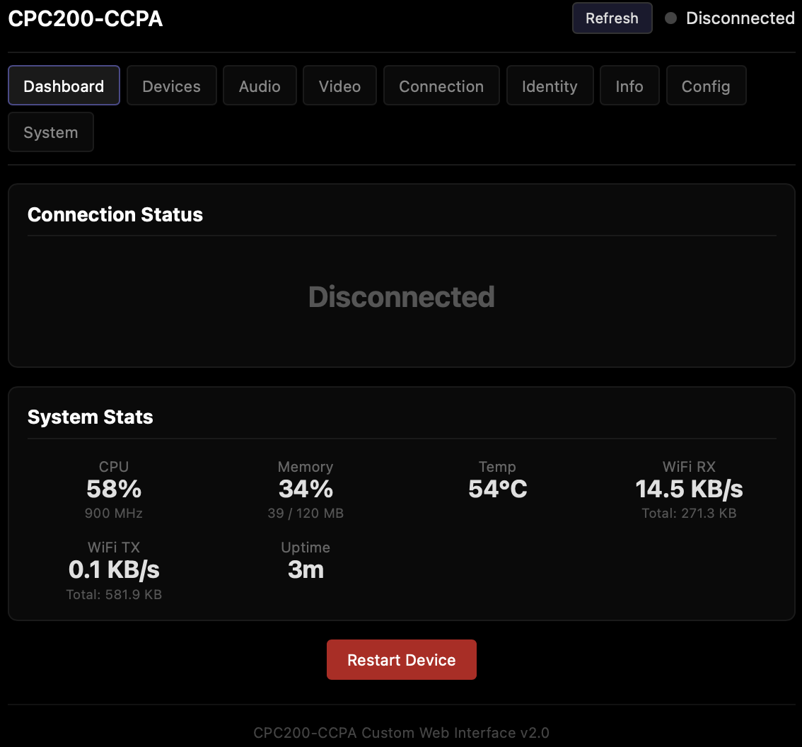
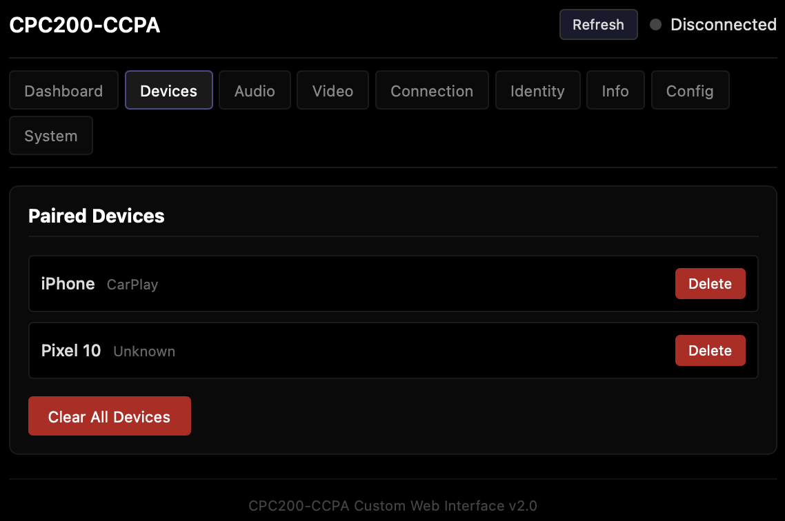
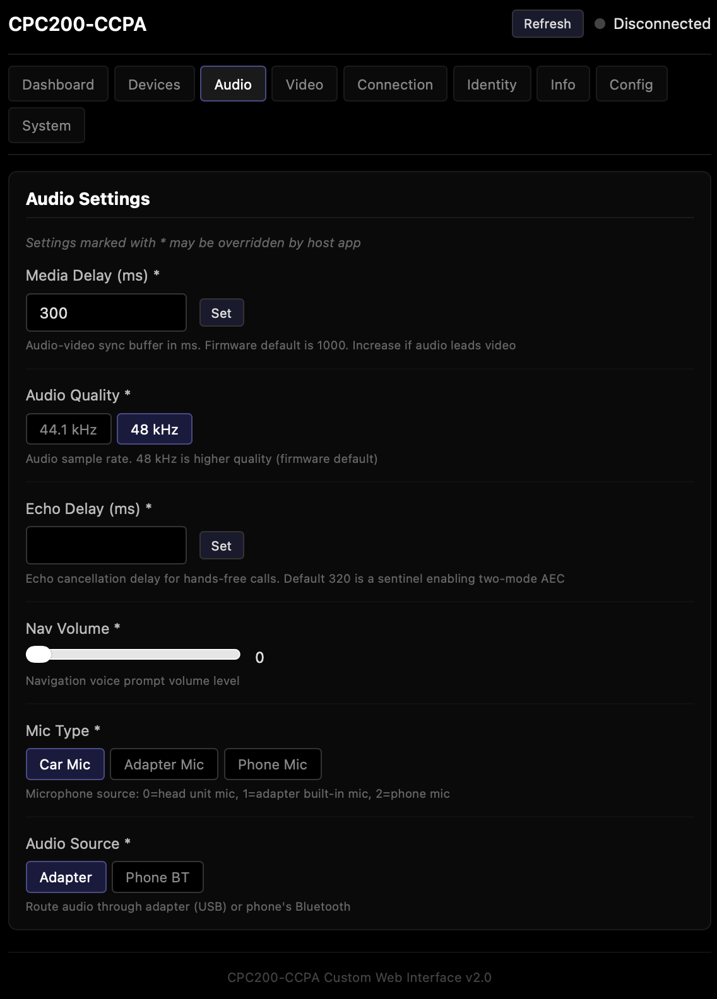
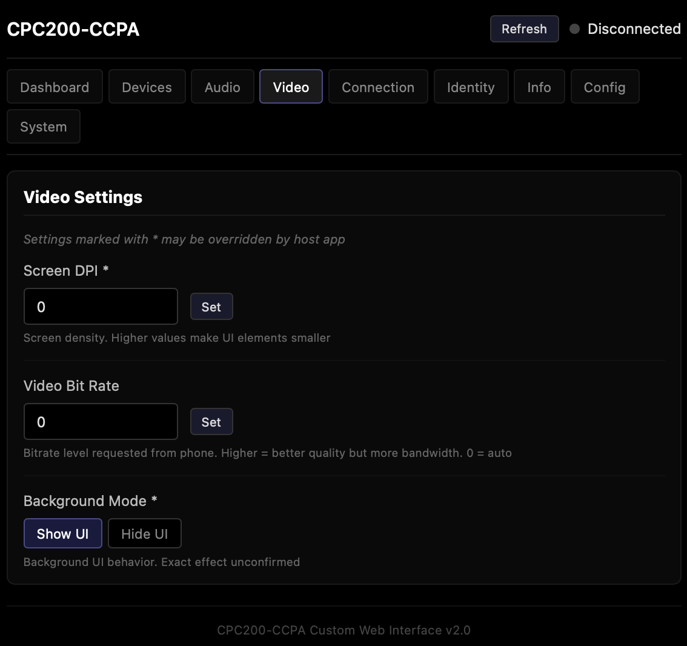
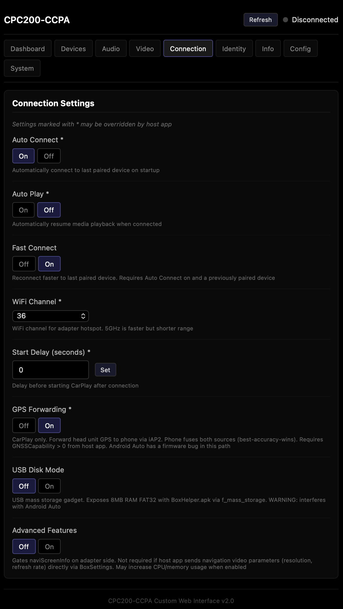
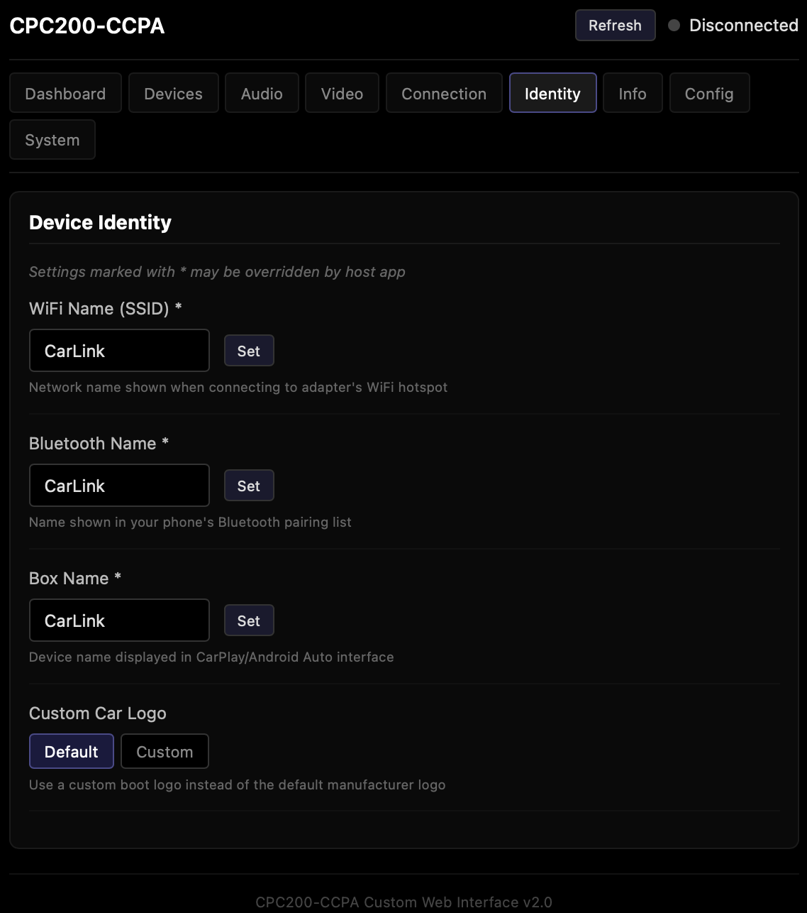
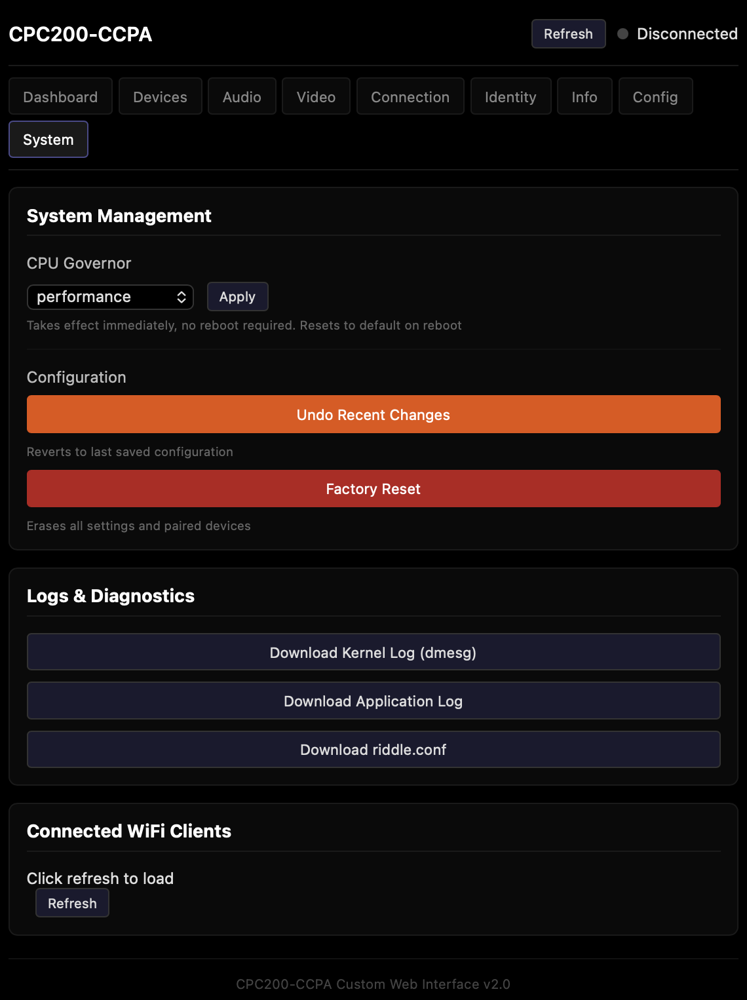

# CPC200-CCPA-Alt-Webstire
Replacement website for the CPC200-CCPA with a CFW

With a Carlinkit CPC200-CCPA Adapter running a custom firmware of 2025.10 release. As long as ssh to adapter is available [Like this CFW](https://github.com/lvalen91/CPC200-CCPA-Firmware-Dump/tree/main/custom_firmware/2025.10.15.1127)

Use the script to install this website which completely replaces the original.

### Diff from Original

- Original Website Storage 500KB, Alt is 70KB
- Added Adapter Resources Status
- Removed Firmware Check to avoid updating and breadking things.
- Delete All devices instead of one at a time between reboots
- Queries riddleBoxCfg for current setting value
- CPU Governor change
- Download Kernel (dmesg) or App (user/tty) Logs
- Download active riddle.conf
- Shows Which device is actively connected

Use it if you want.

#### Install replacement website (removes OEM)                                                                                                               

```
./cpc200_website.sh install 192.168.43.1
```
Copies new webste .tar to adapter tmp storage and removes all Original Website related files, places new website files, and reboots adapter. 

#### Restore OEM website  
```
  ./cpc200_website.sh restore 192.168.43.1
```
Copies old website .tar to adapter tmp storage and removes all files related to the new webstie. Restores the original website and reboots adapter.








